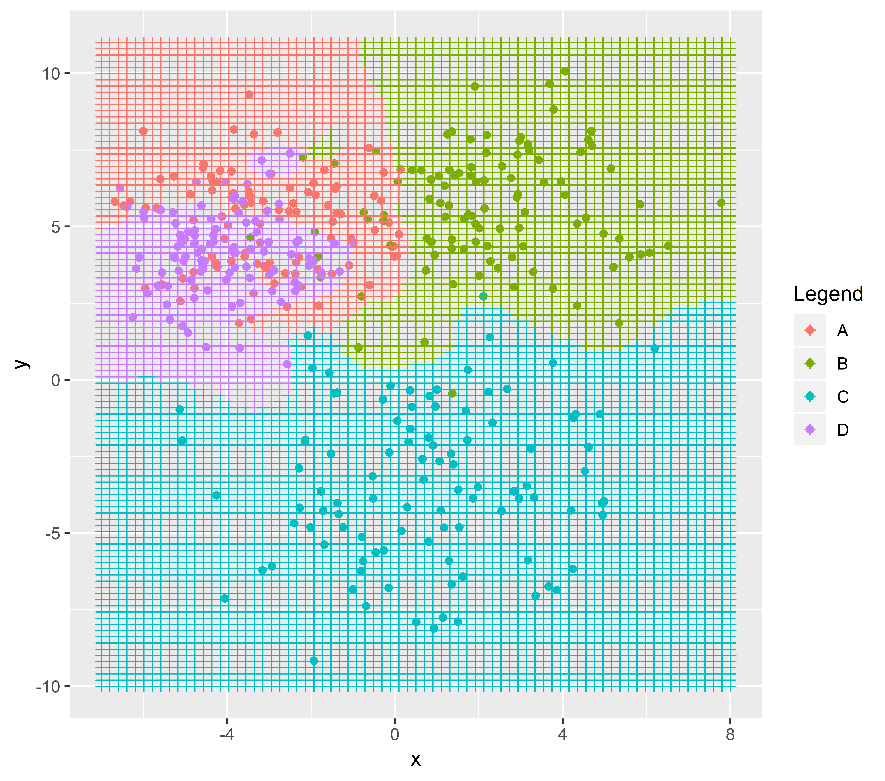
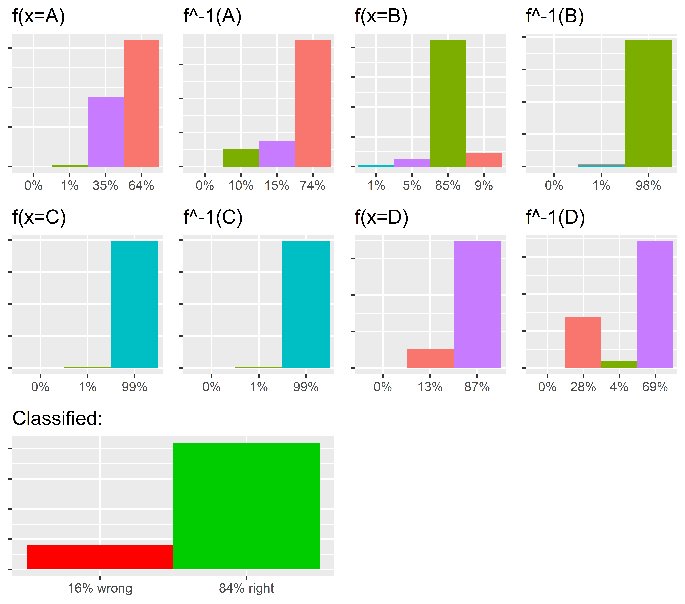

```{r source, echo=FALSE, warning = FALSE, results='hide'}
library(ggplot2)
library(gridExtra)
library(quadprog)
library(R6)
library(MASS)
library(NlcOptim)
library(e1071)
library(shiny)
library(NlcOptim)
library(shiny)
library(rlang)
source("../R/Basis_expansion.R")
source("../R/Test.R")
source("../R/oop.R")
source("../R/Estimators.R")
source("../R/Classifier_funs.R")
source("../R/plot_functions.R")
source("../R/shinyplot.R")
source("../R/Calc_error.R")
set.seed(2)
```

---
title: "LDA & SVM"
author: "Daniel Fridljand, Benedikt Lauer, Henning Stein, Niklas Wünstel"
date: "February 22, 2019"
output: rmarkdown::html_vignette
vignette: >
  %\VignetteIndexEntry{LDA & SVM}
  %\VignetteEngine{knitr::rmarkdown}
  %\VignetteEncoding{UTF-8}
---

## Introduction

This package is an implementation of different discriminent analyses and support vector machines as described in Hastie et al. "The Elements of Statistical Learning" (2009). The implemented algorithms are different methods for solving classification problems. The underlying principle is the the same for all algorithms. Suppose we have a dataset with different observations and can match every such observation to a distinct class. We also assume that the classes cover all possible options any object can be in. What is now the optimal way of partitioning our observation space and assigning any part of it a class that best reflects the observation data. 

A simpler way to put it is to suppose we have our dataset with oberservations and their associated classes and one extra observation that has not been classed yet. Given our observations what is the class the extra point will most likely be in. 

## Motivation

```{r motivatting example, echo = FALSE}
set.seed(2)
height_B <- rnorm(115, mean = 30, sd = 4)
decibel_B <- rnorm(115, mean = 70, sd = 10)
classes_B <- rep("Barock", 115)

height_R <- rnorm(78, mean = 17, sd = 6)
decibel_R <- rnorm(78, mean = 102, sd = 7)
classes_R <- rep("Renaissance", 78)

height_C <- rnorm(96, mean = 42, sd = 7)
decibel_C <- rnorm(96, mean = 64, sd = 8)
classes_C <- rep("Classic", 96)

height <- c(height_B, height_R, height_C)
decibel <- c(decibel_B, decibel_R, decibel_C)
class <- c(classes_B, classes_R, classes_C)

Rockets <- data.frame(decibel = decibel, height = height, class = class)
```

Suppose we have a dataset of 289 observations of skyrockets for sylvester where we have measured both the heigth and the volume of our rckets. There are 115 rockets of the type "Barock", 78 of the type "Renaissance" and 96 of the type "Classic". This allows us to Classify the data with this package. First, we need to create a data_set object out of our data-frame. We do this by typing:

```{r Creation, results='hide'}
Rocket_set <- make_set(Rockets, by = 'class', title = "Rockets", description = "Rockets with their flight heigth")
```
Here we load in our Rockets data-frame and name the columns by which we want to classify with the parameter "by". We now want to see how our classification looks like so we first create a classification function by its name:

```{r Classification function creation}
func_example1 <- LDA(Rocket_set)[['name']]
```

and finally create the plot

```{r LDA example plot, results='hide'}
exampleplot1 <- make_2D_plot(Rocket_set,
               func_example1,
               ppu = 1,
               project = FALSE)
```

which we will disply with:

```{r displaying plot}
exampleplot1
```

If we want to see how good the function has classified the data we create another plot object

```{r Classification example, results='hide', fig.keep='none'}
example_error <- plot_error(Rocket_set, func_example1)
```

and call it:

```{r calling error}
do.call(grid.arrange, example_error)
```

So we see that for this data set LDA is to 89% rigth.

We can also put both these plots together with one simply function:

```{plot_total, results='hide', fig.keep='last'}
plot_summary(Rocket_set, func_example1, ppu = 1, project = FALSE)
```

It is now 0:01 in the morning on January 1st and we see that our neighbour has a rocket that's really loud and we are interested if it one of the now banned rocket of the type "Renaissance". We have observed, that the rocket exploded at about 40 meters and was about 103 decibels loud. So we let our classification function make all the work for us. We get the class of the to be classified point (103, 40) by typing

```{r Point Classification}
Rocket_set$func[[func_example1]](c(103, 40))
```

and find out that LDA tells us that the rocket was of the forbidden type "Renaissance". We can see the Rocket in our plot if we simply add it as a black point:

```{r adding Point}
exampleplot1 <- exampleplot1 + geom_point(aes(x = 103, y = 40))
exampleplot1
```

We are now very close to calling the police for such a violation of the law but to make sure we want QDA to give us the same result as a confirmation because the point is very close at the edge. So we redo the proceedure for QDA

```{r QDA point}
func_example2 <- QDA(Rocket_set)[['name']]
exampleplot2 <- make_2D_plot(Rocket_set,
               func_example2,
               ppu = 1,
               project = FALSE)
exampleplot2 <- exampleplot2 + geom_point(aes(x = 103, y = 40))
exampleplot2
```

We realise that QDA seems to calssify the Point to "Barock" but we are unsure for we have watery eyes because of all the smoke in the air and let QDA give us a definite answer with:

```{r definite answer point}
Rocket_set$func[[func_example2]](c(103, 40))
```

We are now very unsure whether or not he is using the type "Renaissance" and decide to not confront him because we don't want to blame ourselves.

```{r seed setting, echo = FALSE}
set.seed(2)
```

## Shiny

This package comes with a shiny app to make it easier for the user to navigate the package. We can open it the following way.

```{r shinyapp, results='hide', fig.keep='none'}
classify_app()
```

## Linear Disciminent Analysis (LDA)

Linear Discriminant Analyisis (short LDA) is the simplest of the algorithms in this package but has the most presumptions. We suppose that the underlying datat is multivariate normal distributed where every class has **the same** covariance matrix. This is a very strong persumption but still shows very good results in practice. It was among the top three classifiers for 7 out of 22 datasets in the STATLOG project (see Hastie et al. "The Elements of Statistical Learning" (2009) p. 111). The power of LDA comes from its relative simple calculations: Because of the assumption that every class has the same covariance matrix the distance formula is simplyfied to be linear as opposed to qudratic although the underlying distribution is gaussian. This gives LDA its name and shows itself in the classification plot where the classes are seperated by straights:

```{r LDA, warning = FALSE, results='hide', fig.cap="\\label{fig:figs}Classification of randomly generated data with LDA, where each color is associated with one class A,B,C or D as is specified in the legend"}
sig <- c(1.5, 2, 2.5, 1.3)  ##Creating a vector of standard deviations for the the make_test() function
dimension <- 2   ##Number of dimensions the test should have. 2 for simlicity
  
test <- make_test(100, ##Creating a random test where each class has 100 observations
                  nparam = dimension, ##in 2 Dimensions
                  nclasses = 4, ##with 4 classes
                  sigma = sig) ##That are distributed as specified above
  
set <- make_set(test, ##Creating a R6 dataset object with the generated data
                by = "class", ##Column in which the classes of the observations are listed
                title = "R Markdown ",
                description = "R Markdown presentation file")
  
func_name1 <- LDA(set)[['name']] ##Creating the classifier function with LDA. 'name' is the slot in which the function is in
testplot1 <- make_2D_plot(set, ##Creating a ggplot object where the classification image is saved in
                          func_name1, ##Function by which should be classified
                          ppu = 5,
                          project = FALSE) ##Resolution of the background
  
testplot1 ##Actual plotting
```

The above test data was generated using the ``` make_test() ``` function. It randomly generates 100 oberservation of each class with randomly generated expeted values and settable standard deviations. Although the standard deviations for this test were ``` 1.5, 2, 2.5, 1.3 ``` (note that these values are used for each class in both x and y direction) which is far from beeing the same LDA shows quite good results as we can see in the error plot below:

```{r LDA Error, warning=FALSE, results='hide', fig.keep='none'}
liste1 <- plot_error(set, func_name1) ##Saving the LDA Errorplot into an object
```

```{r LDA Errorplot, warning=FALSE, results='hide', fig.cap="\\label{fig:figs} Error in the LDA function where f(x=A) means that objects of class A has been classified to what percentage in the classes shown in the barplot below and f^-1(x=A) means that objects classified to class A are actually to what percentage in the  classes shown in the barplot below. The data plot shows the overall error of the classification"}
do.call(grid.arrange, liste1) ##Plotting the LDA Error
```

Now we can try to make our model more accurate by leaving out some of the assumption. This is what gives us Quadratic Discriminant Analysis.

## Quadratic Discriminant Analysis (QDA)

Since we want to keep assuming that the underlying distribution is gaussian we have to kick the "pooled" covariance matrix and calculate a different one for each given class. These don't cancel each other out as was the case in LDA so the distance function is quadratic in x. This is where the name comes from. 

```{r QDA, warning = FALSE, results='hide', fig.cap="\\label{fig:figs}Classification of randomly generated data with QDA. Note that the data is the same as in LDA above. The syntax of the call remains almost identical."}
func_name2 <- QDA(set)[['name']] ##Setting the Classifier function as QDA
testplot2 <- make_2D_plot(set, ##Creating a plot object for the classification plot
               func_name2,
               ppu = 5,
               project = FALSE)

testplot2 ##Plotting the image
```

As we can see the classes are seperated by quadratic lines which are in some cases combined to be almost elliptical (red and purple). In the example below the total error is 1% less as for LDA but empirical data shows that is far from beeing a typical result. QDA has performed among the top 3 in 4 of 22 datasets in the STATLOG project (see Hastie et al. "The Elements of Statistical Learning" (2009) p. 111)

```{r QDA Error, warning=FALSE, results='hide', fig.keep='none'}
liste2 <- plot_error(set, func_name2) ##Saving the QDA Errorplot into an object
```

```{r QDA Errorplot, warning=FALSE, results='hide', fig.cap="\\label{fig:figs} Error in the QDA function. For further explanations of the barplots see LDA Error"}
do.call(grid.arrange, liste2) ##Plotting the QDA Error
```

For now we have only looked at uncorrelated data which is where LDA and QDA shine but as soon as the data gets correlated they start overfitting. To fight the we need another small model change called Penalized Discriminant Analysis.

## Penalized Discriminant Analysis

To fight overfitting Hastie et al. have proposed a penalized metric where the add a penalty matrix Omega to the covariance matrix. The exact value of Omega has to be found by hand, cross validation, or superb intuition. As a second extra PDA does if needed a basis expansion "quad" for quadratic polynomial, "cube" for cubic polynomial, "sqrt" for squareroot, "log" for logarithm, "abs" for the absolute value or "id" for no basis expansion at all.
The plot below has a quadratic polynomial basis expansion. Note that Omega is quadratic with length 5 because of the basis expansion.

```{r PDA, warning = FALSE, results='hide', fig.cap="\\label{fig:figs}Classification of randomly generated data with PDA. The data is the same again but this time, there is no clear structure in the seperating lines because the Classification is done in the expanded 5-dimensional space."}
func_name3 <-  PDA(set, base = "quad", omega = diag(2, nrow=5))[['name']] ##Setting the Classifier function as QDA
testplot3 <- make_2D_plot(set, ##Creating a plot object for the classification plot
               func_name3,
               ppu = 5,
               project  = FALSE)

testplot3 ##Plotting the image
```

```{r PDA Error, warning=FALSE, results='hide', fig.keep='none'}
liste3 <- plot_error(set, func_name3) ##Saving the PDA Errorplot into an object
```

```{r PDA Errorplot, warning=FALSE, results='hide', fig.cap="\\label{fig:figs} Error in the PDA function. For further explanations of the barplots see LDA Error"}
do.call(grid.arrange, liste3) ##Plotting the PDA Error
```

The data we use here is not correlated at all so PDA does worse than LDA and QDA but there are examples where PDA outperforms LDA. This is the case when the input is highly correlated. For example reading in trying to read in analog image data where each pixel obviously is highly correlated to his neighbouring (for more info see Hastie et al. "The Elements of Statistical Learning" (2009) p. 447).

## RDA

What happens when neither LDA or QDA sufficently classify but PDA is too complex to apply. Regularized Discriminant Analysis (RDA) is an approach to combine the best of both. Instead of using a completely pooled covariance matrix or different covariance matrices for every class RDA takes a convex conjugation of both and fine-tunes the paramter of the conjugation to get the best result. If alpha is 0 RDA is the same as LDA while if alpha is 1 RDA is the same as QDA. Pro: RDA should always be better that both LDA and QDA. Contra: The cross-validation takes some time so the improved performance comes with an increased runtime.

## Support Vector Machines (SVM)

A different approach to the whole problem is the Support Vector Machines. We first try to randomly seperate the classes with a line. This obviously won't classify great so by introducing a margin of error from which we demand that no vector lies further into the wrong class than said margin, we force the line to be bend. All points within the margin of error and only these points are therefore relevant for the seperation of the classes. It is then possible to apply kernels that project the data into a higher dimensional space and where the seperation lines can be straight lines and the classification become simpler. These get then projected back down into the initial space and appear curved. Theoretically there need not be any assumptions towards the underlying distribution so SVM are generally applicable. For further informations into the mathematics behind SVMs see Hastie et al. "The Elements of Statistical Learning" (2009) pp. 417-438. 

This is the result of SVM with a radial kernel for our classification problem above:



In this example the data were normal distributed and we can see in the above plot that SVM overfits quite a bit and this can sometimes lead to result that are better on paper but not necessarily reflect the underlying distribution. This results in the best error rate of all Classifiers in this Vignette:

